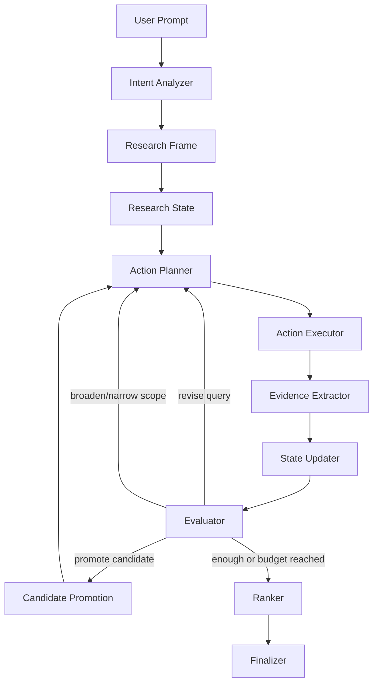

# Apodex-like Graph Heavy Research Engine Design

## Goal

Replace the current fixed Heavy loop with a state-driven research engine that more closely matches the observed Apodex main logic.

The target behavior is not a larger number of agents. The target behavior is:

```text
User prompt
-> infer intent and success criteria
-> build a research frame
-> plan the next best actions
-> execute search/read/extract/verify actions
-> update global research state
-> evaluate quality and gaps
-> replan dynamically
-> promote strong candidates into main lines of investigation
-> rank best possible answers
-> write a sourced final report with explicit uncertainty
```

This design treats Apodex-like Heavy as a research state machine rather than a fixed `Run -> Agent -> Verifier` pipeline.

## Why This Change Is Needed

The current system is real and useful, but it is still task-first:

```text
CoordinatorPlan
-> fixed AgentTask[]
-> each Agent searches independently
-> Verifier finds gaps
-> next Run uses verifier recommended tasks
-> FinalReport
```

That architecture has four important gaps:

1. **No global candidate pool**
   A candidate can appear inside one `AgentReport` but never become the shared focus of later actions.

2. **No global replanning loop**
   Individual agents can revise queries, but the whole inquiry does not continuously ask, "Given what we now know, what should we do next?"

3. **Verifier acts too late**
   The current verifier catches problems after a run completes. Apodex-like behavior adjusts during the investigation.

4. **Final report is evidence-audit oriented**
   The current finalizer often says "unconfirmed" instead of producing a best-effort ranking with evidence, proxy evidence, rejected alternatives, and unresolved gaps.

The Grace Brown / Andromeda case exposed the flaw clearly: the system discovered Andromeda, but did not promote it early enough into a targeted deep dive.

## Evidence From Apodex Samples

The reviewed samples show a consistent main logic across different task types.

### Find Person / Company

Observed pattern:

```text
understand target profile
-> broad English search
-> results are weak
-> revise query using discovered names and exact phrases
-> identify candidate
-> deep-dive candidate
-> compare against alternatives
-> output best possible answer, not just fully confirmed facts
```

In the Grace Brown / Andromeda example, Apodex promoted the candidate because it matched the scarce core pattern:

```text
Australia + founder/CEO + AI robotics hardware + recent public coverage
```

It then treated missing `30% growth` as a gap, but used funding, valuation, production expansion, deployment, and market expansion as proxy growth signals.

### Find Website

Observed pattern:

```text
try primary source
-> primary source blocked
-> use pasted excerpt as clues
-> infer person/name/product entities
-> search multiple clue combinations
-> find candidate website
-> verify identity, story, and business model
```

This is not a fixed website-finder template. It is clue extraction plus iterative query revision.

### Technical Verification

Observed pattern:

```text
define what "works" means
-> search examples and error cases
-> user reports contradiction
-> revise the definition
-> identify hidden criterion
-> re-verify all prior recommendations
-> output corrected table and exclusions
```

For the Cloudflare free subdomain sample, the hidden criterion was:

```text
Public Suffix List inclusion + ability to delegate authoritative NS
```

The system corrected itself after the user challenged an earlier answer.

### Data Workflow Design

Observed pattern:

```text
inspect data shape
-> define pipeline stages
-> identify boundary conditions
-> user challenges contradictions
-> revise assumptions
-> separate what can be inferred from customs data vs what needs external data
-> produce strict ordered gates
```

The system moved from a general scoring model to:

```text
clean data
-> normalize companies
-> strong exclusion
-> strong confirmation
-> gray-zone external verification
-> EOL / HTF fit scoring
-> A/B/C/D/E customer grading
```

### Market List Expansion

Observed pattern:

```text
initial precise list is too small
-> user demands larger scale
-> reassess market ceiling
-> split goals by data quality and scale
-> propose data-source strategy
-> distinguish precise buyers from broad funnel
```

The key behavior is dynamic goal reframing, not simply adding more search results.

### New Seller Sales Strategy

Observed pattern:

```text
identify seller status and constraints
-> verify platform eligibility and costs
-> exclude unsuitable channels
-> prioritize zero-cost and low-friction channels
-> define cold-start sequence
-> include transaction risk and payment safeguards
```

Again, the main logic is generated from task state and constraints.

## Design Principles

1. **State first**
   The system must maintain one shared `ResearchState` for the whole turn.

2. **Dynamic actions, not fixed agents**
   The planner should emit the next actions based on the current state.

3. **Candidate promotion**
   Strong entities must be promoted into first-class investigation tracks.

4. **Every action is logged**
   The UI must show searches, reads, extracted evidence, query revisions, assumptions, and decisions.

5. **English search by default**
   Search queries should be generated in English unless a non-English source is explicitly needed.

6. **Best-effort answers are allowed**
   When exact evidence is missing, the system should separate hard evidence, proxy evidence, assumptions, and unresolved gaps, then still rank the best possible candidates when the user asks for a decision.

7. **No fake work**
   Agents/actions cannot fabricate separate work. Each action must have its own query/read/evidence trace.

## Non-Goals

First version will not implement:

- login or permissions
- billing
- cloud deployment
- database migration from file storage
- a full browser automation crawler
- a fully general web data extraction platform
- copying Apodex visual branding

The goal is internal usable research behavior.

## Proposed Architecture



### Module Layout

Add these modules:

```text
lib/heavy/graph/
  frame.ts
  state.ts
  actions.ts
  planner.ts
  executor.ts
  evidence-extractor.ts
  evaluator.ts
  candidate-pool.ts
  ranker.ts
  finalizer.ts
  graph-orchestrator.ts
```

Keep these modules with smaller adaptations:

```text
lib/heavy/storage.ts
lib/heavy/events.ts
lib/heavy/search-provider.ts
app/api/inquiries/*
app/page.tsx
```

Keep current modules as legacy or compatibility helpers:

```text
lib/heavy/orchestrator.ts
lib/heavy/coordinator.ts
lib/heavy/agent-runner.ts
lib/heavy/verifier.ts
lib/heavy/synthesizer.ts
lib/heavy/adaptive-research.ts
```

The new UI entry should call `graph-orchestrator.ts`. The old orchestrator can remain for tests and fallback until the new engine is stable.

## Core Data Model

### ResearchFrame

`ResearchFrame` is the first model output. It defines how the system should think about the task.

```ts
export type ResearchFrame = {
  id: string;
  taskKind:
    | "find_person_company"
    | "find_website"
    | "technical_verification"
    | "data_workflow_design"
    | "market_list_building"
    | "sales_strategy"
    | "general_research";
  userGoal: string;
  deliverable: string;
  hardConstraints: Constraint[];
  softPreferences: Constraint[];
  exclusionRules: Constraint[];
  evidencePolicy: EvidencePolicy;
  searchPolicy: SearchPolicy;
  rankingPolicy: RankingPolicy;
  stopCriteria: string[];
  initialAngles: ResearchAngle[];
  assumptions: Assumption[];
};
```

Example for Grace Brown-style task:

```text
taskKind = find_person_company
deliverable = ranked CEO candidates with evidence matrix
hardConstraints = Australia, CEO, innovative hardware, not solar/medical/heavy manufacturing
softPreferences = 30% growth, 3+ years, AI article
evidencePolicy = hard evidence preferred; proxy growth evidence allowed but must be labeled
rankingPolicy = must produce best-effort Top 1 / Top 3 if evidence is not empty
```

### ResearchState

`ResearchState` is updated after every action.

```ts
export type ResearchState = {
  frame: ResearchFrame;
  actions: ResearchActionRecord[];
  searchLedger: SearchLedgerEntry[];
  sourceLedger: SourceLedgerEntry[];
  evidenceItems: EvidenceItem[];
  candidatePool: Candidate[];
  promotedCandidates: CandidateId[];
  openQuestions: OpenQuestion[];
  contradictions: Contradiction[];
  rejectedPaths: RejectedPath[];
  assumptions: Assumption[];
  decisionHistory: DecisionTrace[];
  budgets: ResearchBudgetState;
};
```

The state is the main object the planner reads. This is the biggest architectural shift.

### ResearchAction

Planner emits actions, not fixed agent tasks.

```ts
export type ResearchAction =
  | SearchWebAction
  | ReadSourceAction
  | ExtractEvidenceAction
  | ExtractCandidatesAction
  | VerifyConstraintAction
  | PromoteCandidateAction
  | CompareCandidatesAction
  | ReviseQueryAction
  | BroadenScopeAction
  | NarrowScopeAction
  | AuditAssumptionAction
  | RankCandidatesAction
  | FinalizeAction;
```

Each action has:

```ts
type BaseAction = {
  id: string;
  type: string;
  purpose: string;
  rationale: string;
  dependsOn?: string[];
  priority: "low" | "medium" | "high";
};
```

For search:

```ts
export type SearchWebAction = BaseAction & {
  type: "search_web";
  queries: string[];
  expectedSignals: string[];
  avoidQueries?: string[];
  maxResults?: number;
};
```

For verification:

```ts
export type VerifyConstraintAction = BaseAction & {
  type: "verify_constraint";
  candidateId?: string;
  constraintId: string;
  requiredEvidence: string[];
};
```

### Candidate

Candidate is generic enough for people, companies, websites, vendors, domain providers, data workflows, or channels.

```ts
export type Candidate = {
  id: string;
  kind: "person_company" | "website" | "company" | "service" | "workflow" | "channel" | "other";
  name: string;
  aliases: string[];
  summary: string;
  entities: Record<string, string>;
  matchedConstraints: ConstraintMatch[];
  missingConstraints: ConstraintGap[];
  proxyEvidence: EvidenceItem[];
  directEvidence: EvidenceItem[];
  risks: RiskItem[];
  score: number;
  confidence: "low" | "medium" | "high";
  status: "new" | "active" | "promoted" | "rejected" | "ranked";
};
```

This is what the current system lacks.

### EvidenceItem

Evidence is separated from reports.

```ts
export type EvidenceItem = {
  id: string;
  claim: string;
  subjectIds: string[];
  sourceUrl: string;
  sourceTitle: string;
  sourceType: "official" | "profile" | "news" | "directory" | "forum" | "social" | "pdf" | "other";
  quote?: string;
  paraphrase: string;
  supports: string[];
  contradicts: string[];
  strength: "weak" | "medium" | "strong";
  extractedAt: string;
};
```

The final report should read from `EvidenceItem[]`, not only from agent summaries.

## Runtime Loop

### Step 1: Analyze Intent

Input:

```text
user prompt
attachments metadata
previous turn summary if any
```

Output:

```text
ResearchFrame
```

The analyzer must identify:

- what the user actually wants
- whether the output is a decision, list, workflow, verification, or factual lookup
- what counts as success
- what is hard constraint vs soft preference
- what evidence types are acceptable

### Step 2: Plan Actions

Planner reads `ResearchState` and emits up to `N` actions.

Default:

```text
maxActionsPerCycle = 6
maxSearchActionsPerCycle = 4
maxReadActionsPerCycle = 8
```

Planner must include:

- `rationale`
- why these actions are next
- what would make results strong or weak
- what should be avoided because it already failed

### Step 3: Execute Actions

Executor runs compatible actions concurrently:

- search actions can run concurrently
- read actions can run concurrently with a lower limit
- extraction and evaluation actions are sequential because they update state

Executor emits events for every action:

```text
action_planned
action_started
search_performed
source_selected
source_read
evidence_extracted
candidate_extracted
candidate_promoted
action_completed
action_failed
state_evaluated
```

### Step 4: Extract Evidence

After searches and reads, extractor outputs:

- new candidate entities
- source-specific claims
- constraint matches
- contradiction signals
- query clues for future search

The extractor must be source-grounded. If no source supports a claim, the claim can only become an assumption or open question.

### Step 5: Update Candidate Pool

Candidate pool merges equivalent entities.

Examples:

```text
Andromeda
Andromeda Robotics
andromedarobotics.ai
Grace Brown / Andromeda
```

The merger should use:

- exact entity names
- URL domains
- known aliases
- source co-occurrence
- normalized company/person names

### Step 6: Evaluate State

Evaluator decides one of:

```ts
type EvaluationDecision =
  | "continue"
  | "revise_queries"
  | "promote_candidate"
  | "broaden_scope"
  | "narrow_scope"
  | "compare_candidates"
  | "rank_and_finalize"
  | "fail";
```

It must explain:

- what is known
- what is unknown
- what is contradicted
- which candidate/path is promising
- which query/path failed
- what the next cycle should do

### Step 7: Candidate Promotion

Promotion should happen when a candidate has enough high-value signals for the current frame.

Default promotion logic:

```text
promote if:
  direct evidence matches at least 2 hard constraints
  and candidate touches the user's scarce/core concept
  and no fatal exclusion is proven
```

Examples:

- Grace Brown / Andromeda:
  - matches Australia + CEO + AI robotics hardware
  - promote to deep dive
- OpenExamPrep:
  - matches clue story + Ran Chen + free AI exam prep
  - promote to website verification
- Cloudflare domain provider:
  - matches PSL + NS delegation
  - promote to recommended provider

### Step 8: Ranking and Finalization

Finalizer must not default to "unknown" when evidence exists. It should output:

- direct answer
- ranked candidates or recommended path
- condition-by-condition matrix
- evidence chain
- proxy evidence
- rejected alternatives
- unresolved questions
- next best actions

For decision tasks, final report must include:

```text
Best current answer:
Why this is the best answer:
What is confirmed:
What is inferred:
What is not confirmed:
What was rejected:
```

## Search Strategy

Search query generation must be global-state aware.

### Query Rules

1. Use English by default.
2. Do not include task IDs, role names, or placeholders like `{company}`.
3. Never emit `"CEO name"` or `"company name"` as literal query text.
4. Prefer exact phrases once an entity is discovered.
5. Track failed queries and avoid repeating them unless revised.
6. Generate query variants by evidence need:
   - identity
   - official source
   - funding / growth
   - article / interview
   - exclusion / risk
   - directory / database

### Query Revision

If results are weak:

```text
generic query
-> add candidate name
-> add exact phrase
-> add source domain
-> add evidence term
-> use exclusion terms
```

Example:

```text
Australian robotics startup CEO AI article
-> "Grace Brown" "Andromeda" CEO
-> "Grace Brown" "2026: Year of Practical Robots, Not Prototypes"
-> site:andromedarobotics.ai "Grace Brown"
```

## Event Model

Add event types while preserving legacy events.

```ts
type GraphHeavyEvent =
  | { type: "frame_created"; frame: ResearchFrame }
  | { type: "cycle_started"; cycleIndex: number }
  | { type: "actions_planned"; actions: ResearchAction[] }
  | { type: "action_started"; action: ResearchAction }
  | { type: "search_performed"; actionId: string; query: string; provider: string; engine?: string; resultCount: number; results: HeavySearchResult[] }
  | { type: "source_read"; actionId: string; source: HeavySource }
  | { type: "evidence_extracted"; actionId: string; evidence: EvidenceItem[] }
  | { type: "candidate_extracted"; actionId: string; candidates: Candidate[] }
  | { type: "candidate_promoted"; candidate: Candidate; reason: string }
  | { type: "state_evaluated"; decision: EvaluationDecision; reason: string; nextFocus?: string[] }
  | { type: "ranking_completed"; candidates: Candidate[] }
  | { type: "final_reported"; report: FinalReport }
  | { type: "error"; message: string };
```

UI can render these as Apodex-like research process steps.

## Storage

Keep file storage. Add graph state files:

```text
research-runs/inquiries/{inquiryId}.json
research-runs/logs/{turnId}.ndjson
research-runs/graph-state/{turnId}.json
research-runs/sources/{sourceHash}.json
```

`Inquiry JSON` remains the primary API response. `graph-state` exists for debugging, recovery, and UI process replay.

## UI Changes

Current UI already shows:

- run panels
- agent reports
- search logs
- read logs
- final markdown

Add graph-oriented panels:

1. **Research Frame**
   Shows task kind, hard constraints, soft preferences, evidence policy, ranking policy.

2. **Research Process**
   Timeline of planned actions, searches, reads, query revisions, promotions, and evaluator decisions.

3. **Candidate Pool**
   Shows candidates, score, matched/missing constraints, status, and evidence count.

4. **Evidence Matrix**
   Rows are candidates. Columns are constraints. Cells show direct/proxy/missing/contradicted.

5. **Rejected Paths**
   Shows why certain sources, candidates, or assumptions were rejected.

The UI must expose search engines and provider calls just like the current logs do.

## Backward Compatibility

Keep existing Inquiry API shape:

```text
POST /api/inquiries
GET /api/inquiries/:id
GET /api/inquiries/:id/stream
```

Add a mode/config flag:

```text
HEAVY_ENGINE=graph
```

Default should become `graph` once tests pass. During migration:

```text
HEAVY_ENGINE=legacy
```

can run the current orchestrator.

## Error Handling

The engine should not fail the whole turn because one action fails.

Rules:

- failed search action becomes a state event and may trigger query revision
- failed read action may fall back to snippet evidence
- failed extraction action keeps raw source in source ledger
- malformed model JSON is normalized or converted into an evaluator issue
- repeated empty cycles trigger broaden-scope or final-with-uncertainty
- budget exhaustion triggers rank-and-finalize if evidence exists

## Budget Defaults

Initial graph defaults:

```text
maxCycles = 8
maxActionsPerCycle = 6
maxSearchActionsPerCycle = 4
maxQueriesPerSearchAction = 4
maxResultsPerQuery = 30
maxSourcesToReadPerCycle = 12
maxTotalSourcesToRead = 80
maxPromotedCandidates = 8
```

These are more Apodex-like than the current `maxRuns=3`, because a cycle is smaller and more adaptive than a full Run.

## Testing Strategy

### Unit Tests

- `ResearchFrame` normalization
- action normalization
- candidate merge
- candidate promotion rules
- evidence extraction normalization
- query sanitizer rejects placeholders
- evaluator decisions
- ranker scoring

### Integration Tests With Mock Provider

1. **Grace Brown / Andromeda**
   Mock broad search returns multiple robotics candidates. Andromeda appears. Engine promotes it, deep-dives it, and final report ranks it Top 1 with missing growth hard number.

2. **OpenExamPrep**
   Mock primary source blocked. Engine uses pasted clues, finds `OpenExamPrep`, verifies Ran Chen, and outputs the website.

3. **Cloudflare Free Domain**
   Mock initial recommendation includes invalid DNSExit. User contradiction or error evidence causes engine to revise criterion to PSL + NS delegation and reject invalid providers.

4. **Customs Data Workflow**
   Mock attachment metadata. Engine creates workflow frame, separates internal data signals from external verification, and outputs ordered gates.

5. **Distributor List Scaling**
   Engine starts with precise distributor list, discovers market ceiling, reframes into precise vs broad funnel datasets, and recommends data-source strategy.

6. **New Seller Strategy**
   Engine verifies platform eligibility and excludes channels that do not fit a Hong Kong independent seller.

### UI Tests

- renders Research Frame
- renders action timeline
- renders search/read provider logs
- renders candidate pool
- renders evidence matrix
- renders final ranked report

## Migration Plan

This is not an implementation plan, but the design should be implemented in this order:

1. Add graph types and normalizers.
2. Add `ResearchFrame` creation.
3. Add `ResearchState` persistence and event streaming.
4. Add action planner with mockable model calls.
5. Add executor for `search_web` and `read_source`.
6. Add evidence extractor and candidate pool.
7. Add evaluator and candidate promotion.
8. Add ranker and graph finalizer.
9. Wire `graph-orchestrator` behind `HEAVY_ENGINE=graph`.
10. Add UI panels for frame, process, candidates, and evidence matrix.
11. Run sample-based acceptance tests.

## Acceptance Criteria

The feature is acceptable only when:

1. Searches never contain task IDs, roles, or literal placeholders.
2. The UI shows every search engine/provider call and every read source.
3. Strong candidates are promoted and deep-dived automatically.
4. The engine can revise its criterion after contradiction.
5. Final reports include best-effort ranked answers when the prompt asks for a decision.
6. Final reports label direct evidence, proxy evidence, assumptions, and unknowns separately.
7. The six Apodex-derived scenarios pass as mocked integration tests.
8. Logs and saved JSON do not contain secrets.

## Open Decisions

1. Whether to expose both legacy and graph results in the UI during migration.
2. Whether to keep old `Run` terminology in the graph UI or rename it to `Cycle`.
3. Whether candidate scoring should be deterministic first, LLM-assisted first, or hybrid.

Recommended defaults:

- expose only graph for new inquiries once stable
- use `Cycle` internally but render "Research Process" in UI
- use hybrid scoring: deterministic baseline plus model explanation

